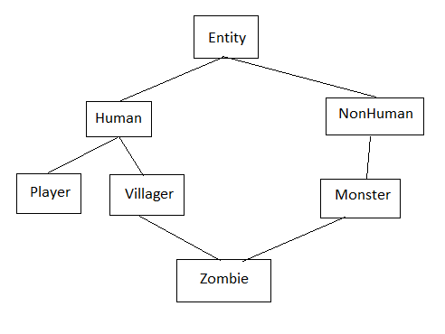

# Entity-Component-System (ECS)

Đây sẽ là phần khó nhất của code. Chúc may mắn =))

## Nếu nó khó vậy, tại sao lại sinh ra cái của nợ này?
Đều là chất xám con người cả đấy. Giả sử mình có một class `Human` -> class `Player`, `Villager` và có một class `NonHuman` -> class `Monster` chẳng hạn (`->` tạm thời kí hiệu là thừa kế). Bây giờ nếu mình muốn tạo ra một con zombie (class `Zombie`) thì rõ ràng là zombie vừa là người vừa không phải người, nhìn cái cây thừa kế đã thấy lỏ lỏ rồi =))

<p align="center">
  
</p>

Giải pháp sinh ra là thay vì tạo từng class cho mỗi thuộc tính như vậy, ta thay thành một bitset, giả sử nếu bit 0 đại diện cho người, bit 1 đại diện cho quỷ, thì con zombie sẽ có cả hai bit đó bật lên. Tiện lợi, right? :))

Ok, nếu bạn đã nói vậy, thì bây giờ quản lí mớ dữ liệu này thì sao? Vì nếu ta không chia class, không có chỗ nào để chứa dữ liệu cả. Tuy nhiên, quan sát kĩ rằng khi ta biến đống class này thành bitset, lúc này mỗi entity trong game được coi là độc lập nhau, bởi vì nó chẳng còn mối quan hệ thừa kế hay class hay gì nữa cả. Vậy, ta sẽ gán cho mỗi entity một cái ID để quản lý từng object một, sau đó ta sẽ có một cấu trúc dữ liệu nào đó giống như cái hộc tủ để lưu dữ liệu của từng entity một vào trong đó, bất chấp kiểu dữ liệu (từ `int`, `float`... đến cả các class tự tạo - component).

Một vấn đề đã được giải quyết. Giờ làm sao để quản lí mớ entity và component này? Câu trả lời là ta sẽ có một hệ thống nào đó, mỗi hệ thống sẽ quản lí một hoặc một vài thuộc tính của một entity. Và nó cũng sẽ có danh sách những entity thuộc quyền quản lí của nó, để biết đường xử lí. Cứ mỗi lần update hay render, nó chỉ cần loop một lần qua mớ entity đó của nó, thay đổi dữ liệu component (ta sẽ dùng một class nào đó để quản lí phần này), thêm xoá sửa dữ liệu, hoạt động trơn tru. Đó chính là lí do vì sao ra đời hệ thống Entity-Component-System (ghép ba đứa lại với nhau).

## Nghe hay đấy, giờ làm sao thực hiện hoá?
### Entity
Ta xử lí từng em một, em Entity trước. Như đã nói, entity chỉ là một cái ID, vì thế mình alias lại cho dễ dùng:

```cpp
#define entity std::uint32_t

const int MAX_ENTITIES = 5000;
```

Bây giờ ta phải làm một cái bitset như đã nói ở trên, bitset này ngành game người ta gọi nó là *signature* (bảng đánh dấu, nghe hợp lí phết).

```cpp
const int MAX_COMPONENTS = 32;

#define Signature std::bitset<MAX_COMPONENTS>
```

Một entity chủ yếu chỉ có hai thuộc tính đó, vì vậy bây giờ ta sẽ tạo một class manager cho nó.

```cpp
#pragma once

#include "const.hpp"
#include <queue>
#include <assert.h>

class EntityManager {
private:
	std::queue<entity> ID;
	std::array<Signature, MAX_ENTITIES> signatures;
public:
	EntityManager() {
		for (entity e = 0; e < MAX_ENTITIES; e++)
			ID.push(e);
	}
	entity createEntity() {
		assert(!ID.empty() && "Entity count reached maximum");
		entity id = ID.front(); ID.pop();
		return id;
	}
	void destroyEntity(entity e) {
		assert(e < MAX_ENTITIES && "EntityManager::destroyEntity(): out of range");
		signatures[e] = 0;
		ID.push(e);
	}
	void setSignature(entity e, Signature signature) {
		signatures[e] = signature;
	}
	Signature getSignature(entity e) {
		assert(e < MAX_ENTITIES && "EntityManager::getSignature(): out of range");
		return signatures[e];
	}
};
```
- Giải thích code sương sương:
	- `EntityManager()`: Đầu tiên, khi khởi tạo manager mình sẽ tạo một cái queue, lúc đầu mình sẽ thêm toàn bộ 5000 cái ID vào đó, là 5000 cái ID này coi như khả dụng, chưa có cái entity nào xài. Với mỗi entity tạo ra mình sẽ lấy cái ID ở đầu queue đặt cho nó, coi như là ID đó đã được xài, mình xoá cái ID đó ra khỏi queue. Rồi tới lúc một entity nào đó bị xoá mình lại thêm nó vào cái queue này, cứ vậy cho tới chừng nào vượt quá `MAX_ENTITIES` thì mình sẽ báo lỗi bằng hàm `assert()`.
	- `createEntity()`: trả về 1 ID cho entity mới. Nếu đã chạm mốc `MAX_ENTITIES` thì báo lỗi.
	- `destroyEntity(e)`: xoá entity đi. Nếu `e > MAX_ENTITIES` thì `e` không tồn tại -> báo lỗi.
	- `setSignature(e, signature)`: Đặt signature của entity `e` là `signature`.
	- `getSignature(e)`: Lấy signature của `e`, lập luận tương tự như `destroyEntity(e)`.

### Mảng Component
- Có 5 điều cần lưu ý:
	- Đây chỉ là một cái mảng thông thường, nhưng nó có thể chứa kiểu dữ liệu nào cũng được (vì nó sẽ chứa các component ta tạo ra, thường là struct hoặc class), vì vậy ta sẽ dùng `template<typename T>` cho nó.
	- Để đỡ tốn RAM đồng thời tăng tốc độ chạy, ta sẽ đảm bảo sao cho mảng luôn liên tục (không có lỗ hổng giữa các phần tử) -> ta đỡ tốn một dòng `if (valid)`. Để được vậy, mỗi khi ta xoá một entity mà không phải entity cuối cùng (entity mới nhất được thêm vào), thì ta sẽ xách cái entity cuối cùng lên vứt vào cái lỗ hổng đó, đồng thời dùng một `map` để lưu lại index dữ liệu của các entity.
	- Đã là mảng, thì nó cũng sẽ có các hàm `insertData(entity e, T component)`, `removeData(entity e)`, `getData(entity e)`.
	- Mỗi khi xoá phần tử (gọi `removeData()`), ta cũng phải cập nhật lại map, vì vậy ta sẽ có một hàm sự kiện `entityDestroyed(entity e)` để biết đường cập nhật map. Ta sẽ gọi nó mỗi khi xoá phần tử.
	- Vì mảng này là một mảng đặc biệt (nó có các tính năng đặc biệt kể trên), ta sẽ tách nó ra thành một class (gọi là `ComponentArray`), và vì ta không thể biết được số lượng `ComponentArray` đang tồn tại, nó phụ thuộc vào số component ta tạo ra (nhưng chẳng lẽ mỗi lần tạo một component là quay vào cái code này sửa lại?), vì thế ta sẽ tạo một lớp cơ sở trừu tượng `IComponentArray`. Lớp này sẽ được thừa kế bởi `ComponentArray`, ta sẽ không dùng tới lớp này để khai báo đối tượng mà chỉ dùng để điều khiển đám `ComponentArray` thôi.
- Chi tiết các bạn có thể đọc tại [đây](https://austinmorlan.com/posts/entity_component_system/).

```cpp
#pragma once

#include "const.hpp"
#include <array>
#include <unordered_map>
#include <assert.h>

class IComponentArray {
public:
	virtual ~IComponentArray() = default;
	virtual void entityDestroyed(entity e) = 0;
};

template<typename T>
class ComponentArray : public IComponentArray {
private:
	// just a wrapper of original arrays
	std::array<T, MAX_ENTITIES> componentArray;
	// better than arrays because search time is O(1)
	std::unordered_map<entity, size_t> entityToIndex;
	size_t arraySize;
public:
	void insertData(entity e, T component) {
		assert(entityToIndex.find(e) == entityToIndex.end() && "Component of entity existed");
		size_t newIndex = arraySize;
		entityToIndex[e] = newIndex;
		componentArray[newIndex] = component;
		++arraySize;
	}
	void removeData(entity e) {
		assert(entityToIndex.find(e) != entityToIndex.end() && "Removing non-existent component");
		// copy element at end into the place of the deleted element to maintain density
		size_t indexOfRemovedElement = entityToIndex[e];
		componentArray[indexOfRemovedElement] = componentArray[arraySize - 1];
		// update map
		entityToIndex[arraySize - 1] = indexOfRemovedElement; // TODO?
		entityToIndex.erase(e);
		--arraySize;
	}
	T& getData(entity e) {
		assert(entityToIndex.find(e) != entityToIndex.end() && "Retrieving non-existent component");
		// return entityToIndex[e]-th element of type T of componentArray[]
		return componentArray[entityToIndex[e]];
	}
	// redefining virtual method
	void entityDestroyed(entity e) override {
		if (entityToIndex.find(e) != entityToIndex.end())
			removeData(e);
	}
};
```

### Component Manager
- Xong cái đám array component đó rồi, giờ ta cần phải quản lí nó. Để việc quản lí thuận tiện ta lại tạo thêm một class mới làm manager. Nó sẽ có các nhiệm vụ như sau:
	- `registerComponent()<T>`: đăng kí component mới với hệ thống ECS, để nó biết đường tạo sẵn một `ComponentArray<T>` dùng thêm bớt dữ liệu. Hàm này sẽ chỉ cập nhật bảng đăng kí thôi, nó sẽ không làm gì cả. Tác dụng của nó sẽ được phát huy khi gọi các hàm `addComponent(e, component)`, `removeComponent(e)`, `getComponent(e)`. Cụ thể, nó sẽ thêm 1 key và 1 ID vào `componentTypes`, thêm 1 key và 1 con trỏ kiểu `ComponentArray<T>` vào `componentArrays`.
	- `getComponentArray()` trả về một con trỏ `shared_ptr` kiểu `ComponentArray<T>`. Nó sẽ lấy mã của `T`, kiểm tra xem đã đăng kí chưa, nếu chưa thì sẽ `assert` ngay tại đó, nếu rồi sẽ ép các con trỏ `shared_ptr<IComponentArray>` trở thành kiểu `shared_ptr<ComponentArray<T>>` rồi trả về một con trỏ để thay đổi dữ liệu. Nhờ đó mà các hàm `addComponent(e, component)`, `removeComponent(e)`, `getComponent(e)` có thể hoạt động được.
	- `EntityDestroyed()` sẽ được gọi khi một entity bị xoá và sẽ được thông báo cho tất cả các manager biết thông qua một hệ thống khác, tạm gọi là `Coordinator`.
- Về mặt tài nguyên, class có:
	- Một map để chứa key: mã `T`, value: ID component.
	- Một map khác chứa key: mã `T`, value: con trỏ trỏ đến `ComponentArray<T>`.
- Một số từ khoá: `std::make_shared`, `std::static_pointer_cast`.

```cpp
#pragma once

#include "component_array.hpp"
#include <memory>

class ComponentManager {
public:
	template<typename T>
	void registerComponent() {
		const char* typeName = typeid(T).name();
		assert(componentTypes.find(typeName) == componentTypes.end() && "Registering component type more than once.");
		componentTypes.insert({ typeName, nextComponentType });
		// create a ComponentArray shared pointer & add it to the component arrays map
		componentArrays.insert({ typeName, std::make_shared < ComponentArray<T>>() });
		++nextComponentType;
	}
	template<typename T>
	componentType getComponentType() {
		const char* typeName = typeid(T).name();
		assert(componentTypes.find(typeName) != componentTypes.end() && "Component not registered before use");
		return componentTypes[typeName];
	}
	template<typename T>
	void addComponent(entity e, T component) {
		getComponentArray<T>()->insertData(e, component);
	}
	template<typename T>
	void removeComponent(entity e) {
		getComponentArray<T>()->removeData(e);
	}
	template<typename T>
	T& getComponent(entity e) {
		return getComponentArray<T>()->getData(e);
	}
	void entityDestroyed(entity e) {
		for (auto const& pair : componentArrays) {
			auto const& component = pair.second;
			component->entityDestroyed(e);
		}
	}
private:
	std::unordered_map<const char*, componentType> componentTypes;
	std::unordered_map<const char*, std::shared_ptr<IComponentArray>> componentArrays;
	componentType nextComponentType; // counter (setting IDs for components)
	template <typename T>
	std::shared_ptr<ComponentArray<T>> getComponentArray() {
		const char* typeName = typeid(T).name();
		assert(componentTypes.find(typeName) != componentTypes.end() && "Component not registered before use");
		// return pointer of type IComponentArray
		return std::static_pointer_cast<ComponentArray<T>>(componentArrays[typeName]);
	}
};
```
### System và System Manager
Gần xong rồi, cố lên.

Bây giờ ta đã có được entity và component, được quản lí đầy đủ thông qua `EntityManager` và `ComponentManager`. Bây giờ ta cần một hệ thống làm việc với hai đứa này, đó chính là `System`. Lớp `System` mới sẽ là một lớp cơ sở trừu tượng để các system ta tự tạo sau này sẽ dẫn xuất từ lớp này. Và đã nói như vậy, nghĩa là sẽ có nhiều system, mà đã có nhiều system thì sẽ phải có một `SystemManager` để quản lí đống system này. Có vẻ bạn đang dần quen quy luật rồi đấy =))

- `SystemManager` sẽ giống `ComponentManager` ở vài chỗ, vì nó cũng làm việc với những đứa con của nó thông qua con trỏ `shared_ptr<T>` (do các system ta sắp tạo cũng là một class), vì vậy nó cũng có `registerSystem()`, `entityDestroyed(entity e)` (thông báo cho các system kia biết -> xoá entity ra khỏi toàn bộ các system, vì các system chỉ quản lí một/một số component -> nhiều system). Nhưng nó sẽ có thêm hai hàm mới:
	- `SetSignature(Signature signature)`: vì một system chỉ quản lí một vài component (tương đương một vài bit trong bitset), nên các system cũng có signature riêng, với bit 1 thì nó sẽ quản lí component đó, bit 0 thì không quản lí.
	- `EntitySignatureChanged(entity e, Signature entitySignature)`: khi một entity thay đổi signature (mất/thêm một vài component), có thể một số system sẽ không quản lí nó nữa, có thể một số system mới sẽ bắt đầu quản lí nó. Hàm này sẽ loop qua toàn bộ các system, kiểm tra rằng nếu `entitySignature & systemSignature == systemSignature` (`systemSignature < entitySignature` là cái chắc, vì nó chỉ quản lí một số component, chắc chắn rằng entity có nhiều component hơn như vậy). Nếu điều kiện đúng, system giữ lại entity, sai thì nó xoá entity ra khỏi danh sách của nó.

```cpp
#pragma once

#include "const.hpp"
#include <set>
#include <unordered_map>
#include <memory>
#include <iostream>

class System {
public:
	std::set<entity> entities;
};

class SystemManager {
private:
	std::unordered_map<const char*, Signature> signatures;
	std::unordered_map<const char*, std::shared_ptr<System>> systems;
public:
	template<typename T>
	std::shared_ptr<T> registerSystem() {
		const char* typeName = typeid(T).name();
		assert(systems.find(typeName) == systems.end() && "Registering system more than once");
		auto system = std::make_shared<T>();
		systems.insert({ typeName, system });
		return system;
	}

	template<typename T>
	void setSignature(Signature signature) {
		const char* typeName = typeid(T).name();
		assert(systems.find(typeName) != systems.end() && "System used before registered");
		signatures.insert({ typeName, signature });
	}

	void entityDestroyed(entity e) {
		for (auto const& pair : systems) {
			auto const& system = pair.second;
			system->entities.erase(e);
		}
	}

	void entitySignatureChanged(entity e, Signature signature) {
		for (auto const& pair : systems) {
			auto const& type = pair.first;
			auto const& system = pair.second;
			auto const& systemSignature = signatures[type];
			// checking if system manages entity (systemSignature < signature)
			if ((signature & systemSignature) == systemSignature) {
				system->entities.insert(e);
			}
			else {
				system->entities.erase(e);
			}
		}
	}
};
```
### Bước cuối cùng
Ba hệ thống Entity-Component-System đã hoàn thành, nhưng vấn đề là nó chưa thể giao tiếp với nhau được. Ta cần chúng hoạt động cùng nhau để quản lí dữ liệu, vì thế ta tạo thêm một class nữa gọi là `Coordinator` (hết tên đặt :)))

Class này cũng dễ nên chắc mình không cần giải thích đâu nhỉ.

```cpp
#pragma once

#include "component_manager.hpp"
#include "system_manager.hpp"
#include "entity_manager.hpp"

class Coordinator {
private:
	std::unique_ptr<ComponentManager> componentManager;
	std::unique_ptr<EntityManager> entityManager;
	std::unique_ptr<SystemManager> systemManager;
public:
	void init() {
		// create unique pointers to each manager
		componentManager = std::make_unique<ComponentManager>();
		entityManager = std::make_unique<EntityManager>();
		systemManager = std::make_unique<SystemManager>();
	}
	entity createEntity() {
		return entityManager->createEntity();
	}
	void destroyEntity(entity e) {
		entityManager->destroyEntity(e);
		componentManager->entityDestroyed(e);
		systemManager->entityDestroyed(e);
	}
	// component methods
	template <typename T>
	void registerComponent() {
		componentManager->registerComponent<T>();
	}
	template <typename T>
	void addComponent(entity e, T component) {
		componentManager->addComponent(e, component);
		auto signature = entityManager->getSignature(e);
		// set property: componentManager->getComponentType() of type T
		signature.set(componentManager->getComponentType<T>(), true);
		entityManager->setSignature(e, signature);
		// called when add a component
		systemManager->entitySignatureChanged(e, signature);
	}
	template <typename T>
	T& getComponent(entity e) {
		// get all components of e
		return componentManager->getComponent<T>(e);
	}
	template <typename T>
	componentType getComponentType() {
		// get ID for component type T
		return componentManager->getComponentType<T>();
	}
	// system methods
	template <typename T>
	std::shared_ptr<T> registerSystem() {
		return systemManager->registerSystem<T>();
	}
	template <typename T>
	void setSystemSignature(Signature signature) {
		systemManager->setSignature<T>(signature);
	}
};
```

## Ngon, có ECS rồi, giờ xài sao?
Đây là lí do bạn thấy ở `game.hpp` mình có `entity player` (for testing purposes only :)).

Để dùng được thì dĩ nhiên, bạn cần có cả entity, component và system :)) entity ta có rồi, component mình đặt đại hai cái struct `TransformComponent` (quản lí vị trí, tốc độ) và `SpriteComponent` (quản lí sprite).

Trong này có một số cái liên quan tới animation, tạm thời bỏ qua nhé.

```cpp
#pragma once

#include <SDL.h>
#include <vector>
#include "vec.hpp"

struct SpriteComponent {
	SDL_Texture* texture;
	std::vector<SDL_Rect> animRects; // cai nay nay
	// frameCount = animRects.size()
	int frameIndex, animSpeed; // cai nay
	bool animated; // cai nay
	SDL_RendererFlip flips; // cai nay
};


struct TransformComponent {
	Vec position, velocity;
};
```

Rồi đến system, mình có một system là để quản lí animation (code cũng không quá khó hiểu) và một system khác để quản lí vị trí (movement). `AnimationSystem` là để quản lí sprites, animation, render; `MovementSystem` quản lí vị trí. Cả hai đều có hàm `update()`, nhưng `render()` thì để `AnimationSystem` lo, ta chỉ cần đặt các hàm này vào đúng chỗ trong class `Game` là được.

[animation_system.hpp](https://github.com/saocodon/game/blob/main/sys/animation_system.hpp)
[movement_system.hpp](https://github.com/saocodon/game/blob/main/sys/movement_system.hpp)

Voilà, xong rồi!