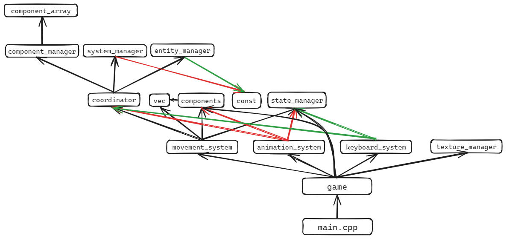

# Lớp `Game` và tổng quan code

>✏️ [saocodon](https://github.com/saocodon)
>⌛ 18/1/24

## Lớp Game

Để quản lí đối tượng dễ dàng hơn, đồng thời có thể thêm bất cứ thứ gì ngoài các sự kiện của game ở file chính, mình tạo ra một class `Game` mới.

```cpp
#pragma once

// include...

class Game {

public:
	Game() {}
	~Game() {}

	void init(const char* title, int x, int y, int w, int h, int flags);
	void handleEvents();
	void update();
	void render();
	void clean();
	
	bool running() { return isRunning; }

private:
	bool isRunning;
	SDL_Window* window;
	SDL_Event ev;
	SDL_Renderer* renderer;
	std::shared_ptr<MovementSystem> movementSystem;
	std::shared_ptr<AnimationSystem> animationSystem;
	std::shared_ptr<KeyboardSystem> keyboardSystem;
	entity player;
};
```

- `#pragma once`: còn gọi là include guard, có tác dụng bảo vệ các file được include sao cho các file header `.hpp` chỉ được include đúng 1 lần duy nhất. Nếu được include từ 2 lần trở lên, những gì được định nghĩa trong file đó cũng được định nghĩa 2 lần, gây ra lỗi linker.
- Hàm tạo, hàm huỷ: hiện tại ta chưa xét tới nó.
- Các hàm:
	- `init(title, x, y, w, h, flags)`: khởi tạo cửa sổ bằng cách khởi tạo cho các con trỏ `*window`, `*renderer`, khởi động hệ thống SDL và vẽ cửa sổ. `title` là tên cửa sổ, `x`, `y`, `w`, `h` lần lượt là toạ độ và kích cỡ cửa sổ, `flags` là các tham số đi kèm, có thể tham khảo tại [SDL Wiki](https://wiki.libsdl.org/SDL2/SDL_CreateWindow) và [main.cpp](https://github.com/Team-BigDy/game/blob/main/core/game.cpp)
	- `isRunning()`: vì `isRunning` là biến `private` nên để chặn hàm while ở `main.cpp` ta cần lấy ra được biến này.
	- Các hàm kia khá là dễ hiểu, đọc file `game.cpp` là hiểu liền, tự đọc nhé :)
- Các biến:
	- 3 biến `std::shared_ptr<T>` dùng để điều khiển các hệ thống trong hệ thống ECS. Cái này sẽ nói sau.
	- `entity player`: mình tạo demo thôi :) `entity` đã được định nghĩa bằng `std::uint32_t` trong `const.hpp`, bản chất nó chỉ là một cái ID của entity trong game thôi :)

## Tổng quan code
### Biểu đồ include
<p align="center">
  
</p>