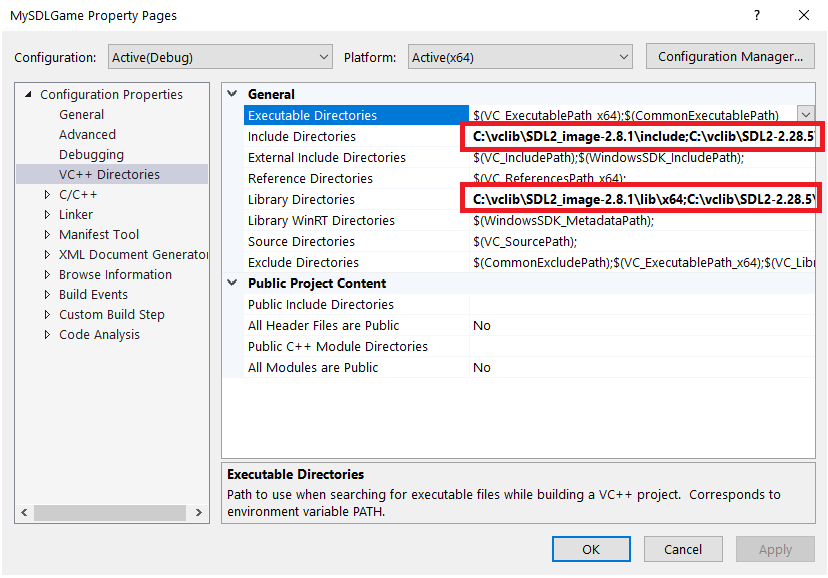
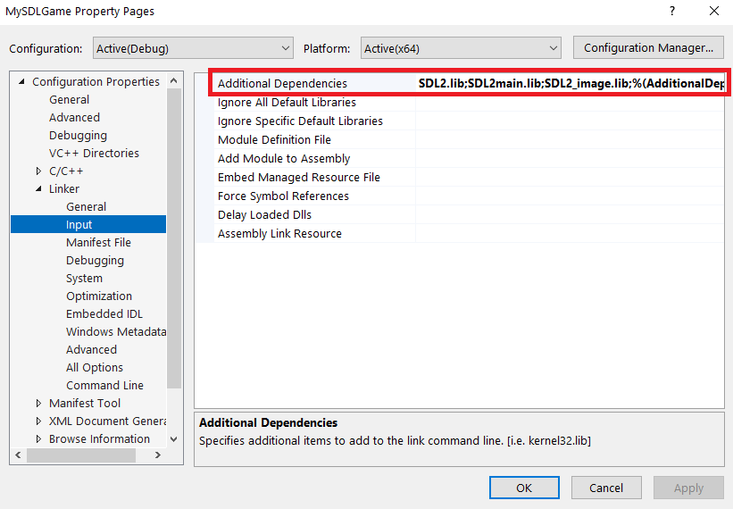

# Cài đặt môi trường

Chúng mình dùng Visual Studio 2022 để code game này :)

1. Tải những thư viện sau về (bản VC):
	- [SDL2](https://github.com/libsdl-org/SDL/releases)
	- [SDL_image](https://github.com/libsdl-org/SDL_image/releases/)
2. Giải nén ra và bỏ trong một thư mục nào đó an toàn.
3. Mở project Visual Studio, nhấn **Alt+F7**, chọn **VC++ Dictionaries**. Thêm đường dẫn thư viện vào những chữ được bôi đỏ.
	
4. Tìm **Linker** > **Input**. Thêm các file thư viện **.lib** ở đó.
	
5. Copy `SDL_image.dll` vào thư mục build của bạn. Nếu cần thì copy thêm `SDL2.dll` cho vào đó.